# Bedrock Agents - AIOps Flow Diagram

```mermaid
flowchart TB
    subgraph Setup["1️⃣ Setup & Configuration"]
        A[Configure SMUS Domain] --> B[Create Git Connection]
        B --> C["Create Project Profile<br/>'bedrock-agents'"]
        C --> D["Configure Secrets Manager<br/>GitHub Token"]
    end

    subgraph ProjectCreation["2️⃣ Project Creation"]
        E["Data Scientist creates<br/>SMUS Project"] --> F["EventBridge captures<br/>CreateProject event"]
        F --> G["Step Functions triggers<br/>repository creation"]
        G --> H["Lambda creates<br/>Build & Deploy repos"]
        H --> I1[agent-build-repo]
        H --> I2[agent-deploy-repo]
    end

    subgraph BuildPipeline["3️⃣ GitHub Actions Build Trigger"]
        J["Code push to<br/>build repo"] --> K["GitHub Actions<br/>workflow triggered"]
        K --> L{"TRIGGER_PIPELINE_EXECUTION<br/>= true?"}
        L -->|No| L1[Exit gracefully]
        L -->|Yes| M["Configure AWS<br/>credentials via OIDC"]
        M --> N["Create/Update<br/>SageMaker Pipeline"]
        N --> O["Start Pipeline<br/>Execution"]
    end

    subgraph SageMakerPipeline["4️⃣ SageMaker ML Pipeline - Agent Build"]
        O --> P1["📦 Step 1: Setup<br/>Processing Job"]
        P1 --> P2["🤖 Step 2: Create/Update<br/>Bedrock Agent"]
        P2 --> P3["📚 Step 3: Create<br/>Knowledge Base"]
        P3 --> P4["⚡ Step 4: Deploy<br/>Action Group Lambdas"]
        P4 --> P5["🔗 Step 5: Associate<br/>Action Groups to Agent"]
        P5 --> P6["✅ Step 6: Prepare Agent<br/>DRAFT version"]
    end

    subgraph Evaluation["5️⃣ Agent Evaluation (SageMaker Pipeline)"]
        P6 --> T["📊 Step 7: Run Test Cases<br/>Processing Job"]
        T --> U{"Success Rate<br/>>= 80%?"}
        U -->|No| V["❌ Pipeline Failed<br/>Review test cases"]
        U -->|Yes| W["Step 8: Create Agent<br/>Alias 'staging'"]
        W --> X["Step 9: Register in<br/>Model Registry"]
        X --> Y["Set Status:<br/>PendingManualApproval"]
    end

    subgraph Approval["6️⃣ Agent Approval"]
        Y --> Z["ML Engineer reviews<br/>Agent in SMUS Console"]
        Z --> AA["Test Agent via<br/>Bedrock Console"]
        AA --> AB{"Approve<br/>Agent?"}
        AB -->|No| AC["❌ Rejected<br/>Back to development"]
        AB -->|Yes| AD["Update Status:<br/>Approved"]
    end

    subgraph DeployTrigger["7️⃣ Automated Deploy Trigger"]
        AD --> AE["Model Registry<br/>approval event"]
        AE --> AF["EventBridge rule<br/>detects approval"]
        AF --> AG["Lambda invokes<br/>GitHub Actions"]
        AG --> AH["Deploy workflow<br/>triggered via<br/>workflow_dispatch"]
    end

    subgraph DeployPipeline["8️⃣ Agent Deployment Pipeline"]
        AH --> AI[Checkout deploy repo]
        AI --> AJ["Configure AWS<br/>credentials via OIDC"]
        AJ --> AK["Get approved<br/>Agent from Registry"]
        AK --> AL["CDK synth &<br/>deploy stack"]
        AL --> AM["Create Production<br/>Agent Alias 'prod'"]
        AM --> AN["Update Action Group<br/>Lambda permissions"]
        AN --> AO["Run Integration<br/>Tests"]
    end

    subgraph Production["9️⃣ Production Ready"]
        AO --> AP{"Tests<br/>Pass?"}
        AP -->|No| AQ["❌ Rollback<br/>to previous alias"]
        AP -->|Yes| AR["✅ Agent Live<br/>in Production"]
        AR --> AS["Monitor via<br/>CloudWatch"]
        AS --> AT["Invoke Agent via<br/>Bedrock Runtime API"]
    end

    Setup --> ProjectCreation
    ProjectCreation --> BuildPipeline

    classDef setup fill:#e1f5fe,stroke:#01579b
    classDef build fill:#fff3e0,stroke:#e65100
    classDef sagemaker fill:#fff8e1,stroke:#f57f17
    classDef eval fill:#f3e5f5,stroke:#7b1fa2
    classDef approve fill:#e8f5e9,stroke:#2e7d32
    classDef deploy fill:#fce4ec,stroke:#c2185b
    classDef prod fill:#e0f2f1,stroke:#00695c
```

## Diagrama Simplificado de Alto Nivel

```mermaid
flowchart LR
    subgraph Input
        A["👤 Data Scientist"]
    end
    
    subgraph SMUS["SageMaker Unified Studio"]
        B["Create Project<br/>profile: bedrock-agents"]
    end
    
    subgraph Automation["Event-Driven Automation"]
        C[EventBridge] --> D[Step Functions]
        D --> E[Lambda]
    end
    
    subgraph GitHub
        F[agent-build-repo]
        G[agent-deploy-repo]
    end
    
    subgraph Build["GitHub Actions"]
        H["Trigger SageMaker<br/>Pipeline"]
    end

    subgraph SageMaker["SageMaker ML Pipeline"]
        I["Create Agent"] --> J["Add Knowledge Base"]
        J --> K["Add Action Groups"]
        K --> L["Evaluate Agent"]
        L --> M["Register in<br/>Model Registry"]
    end
    
    subgraph Approval
        N["Review & Approve<br/>in Model Registry"]
    end
    
    subgraph Deploy["Deploy Pipeline"]
        O[CDK Deploy] --> P[Create Prod Alias]
        P --> Q[Integration Tests]
    end
    
    subgraph Production
        R["🤖 Bedrock Agent<br/>Live Endpoint"]
    end
    
    A --> B --> C
    E --> F & G
    F --> H
    H --> I
    M --> N
    N -->|Approved| G
    G --> O
    Q --> R
```

## Comparación: Regression vs Bedrock Agents

| Aspecto | Regression (ML Clásico) | Bedrock Agents (GenAI) |
|---------|------------------------|------------------------|
| **GitHub Actions** | Trigger SageMaker Pipeline | Trigger SageMaker Pipeline |
| **SageMaker Pipeline** | Preprocessing → Training → Evaluation | Setup → Create Agent → KB → Action Groups → Evaluate |
| **Modelo** | XGBoost entrenado | Foundation Model (Claude) + Configuración |
| **Registro** | Model Registry (model.tar.gz) | Model Registry (Agent ID + Alias) |
| **Métricas** | MSE, RMSE, R² | Success Rate, Response Quality |
| **Aprobación** | Model Registry Status | Model Registry Status |
| **Deploy Trigger** | EventBridge → Lambda → GitHub | EventBridge → Lambda → GitHub |
| **Deployment** | SageMaker Endpoint | Agent Alias 'prod' |

## SageMaker Pipeline Steps para Bedrock Agents

```mermaid
flowchart LR
    subgraph SageMakerPipeline["SageMaker ML Pipeline"]
        direction TB
        S1["📦 ProcessingStep<br/>Setup & Validation"]
        S2["🤖 ProcessingStep<br/>Create Bedrock Agent"]
        S3["📚 ProcessingStep<br/>Create Knowledge Base"]
        S4["⚡ ProcessingStep<br/>Deploy Action Lambdas"]
        S5["🔗 ProcessingStep<br/>Associate to Agent"]
        S6["✅ ProcessingStep<br/>Prepare Agent"]
        S7["📊 ProcessingStep<br/>Evaluate Agent"]
        S8["🏷️ ConditionStep<br/>Check Success Rate"]
        S9["📝 RegisterModel<br/>to Model Registry"]
        
        S1 --> S2 --> S3 --> S4 --> S5 --> S6 --> S7 --> S8
        S8 -->|"≥80%"| S9
        S8 -->|"<80%"| F1["❌ FailStep"]
    end
```

## Componentes del Flujo

| Fase | Componente | Función |
|------|------------|---------|
| **1. Setup** | Project Profile `bedrock-agents` | Template para proyectos de agentes |
| **2. Creation** | EventBridge + Step Functions | Orquesta creación de repos |
| **3. Build Trigger** | GitHub Actions | Dispara SageMaker Pipeline |
| **4. ML Pipeline** | SageMaker Pipeline | Orquesta creación y configuración del agente |
| **5. Evaluate** | ProcessingStep + Test Cases | Valida respuestas del agente (≥80% success) |
| **6. Register** | Model Registry | Registra Agent ID + metadata |
| **7. Approve** | SMUS Console / Model Registry | Aprobación manual del agente |
| **8. Deploy Trigger** | EventBridge + Lambda | Dispara deploy automático |
| **9. Deploy** | CDK + GitHub Actions | Despliega alias de producción |
| **10. Production** | Bedrock Runtime | Agente listo para invocación |
